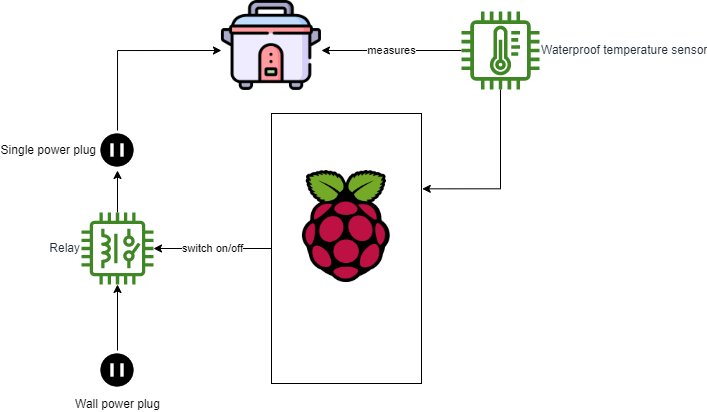
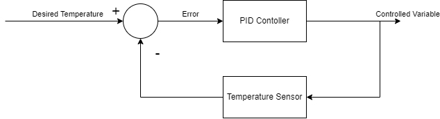

# Sous Vide Cheap

## Overview
This is a project to make a cheap, but functional, sous vide. The main goal 
is to learn more about electronics so don't expect it to be perfect.

## Components
* [Raspberry Pi Pico](https://www.raspberrypi.org/products/pico-pi/)
* [DS18B20](https://datasheets.maximintegrated.com/en/ds/DS18B20.pdf) (Waterproof Temperature Sensor)
* [SRD-05VDS-SL-C](https://www.circuitbasics.com/wp-content/uploads/2015/11/SRD-05VDC-SL-C-Datasheet.pdf) (Relay)
* Rice Cooker

## Diagram

## Logic

The system will implement a simple PID controller to control the 
temperature based on a target temperature.

The following diagram represents the logic:

